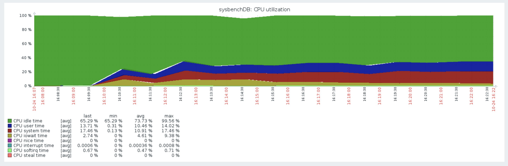
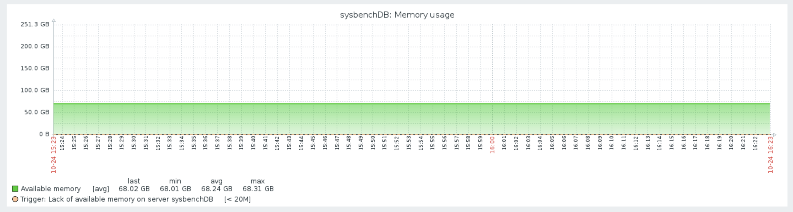
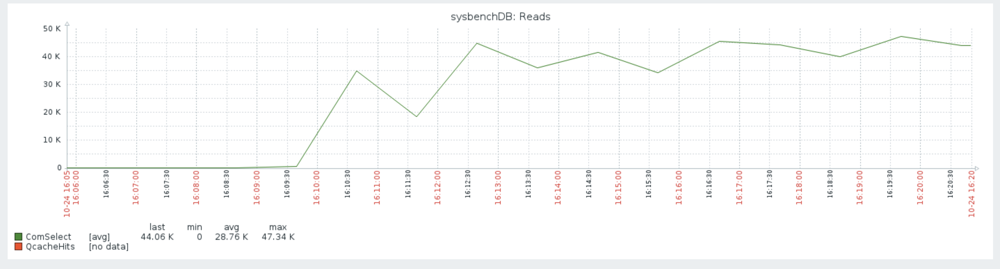
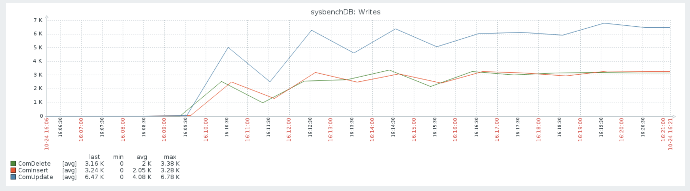
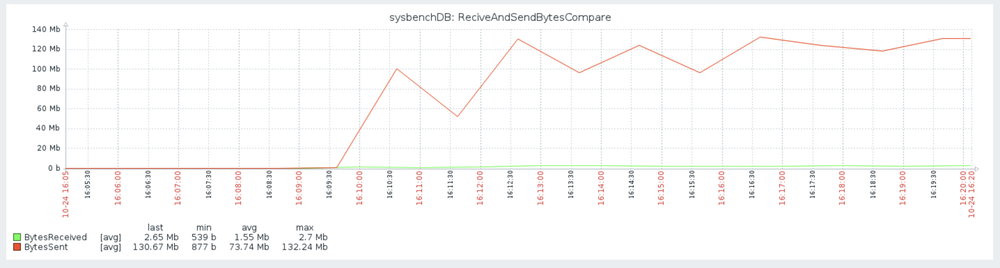
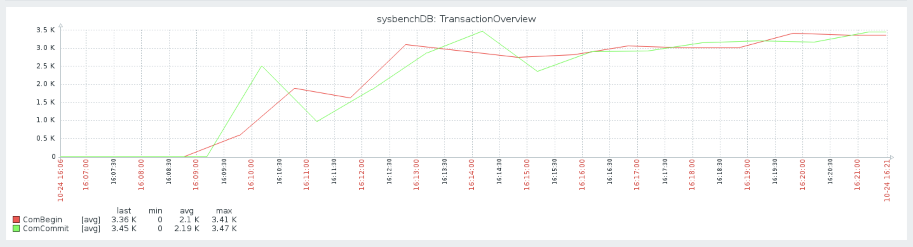
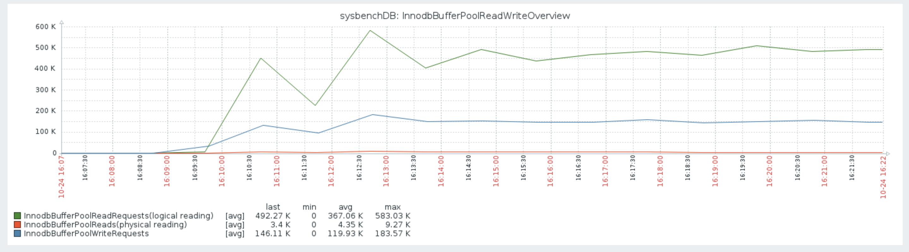

# mysqltools-python权威指南
---
主编&作者:**蒋乐兴**

wechat:**jianglegege**

email:**1721900707@qq.com**

homepage:**http://www.sqlpy.com**

---

- [关于](#关于)
- [安装](#安装)
- [监控](#监控)
- [MySQL慢查询工具](#MySQL慢查询工具)
- [端口检测工具](#端口检测工具)
- [大文件分析](#大文件分析)
---

## 关于
   **1): 什么是mysqtools-python** mysqltools-python是一个Python工具包，它的主要功能是可以完成对MySQL的“监控”，“备份”，“巡检(开发中)”，“自动故障分析与解决(开发中)”

   ---

## 安装
   **目前mysqltools-python支持python-3.x 下的所有版本,可以直接通过pip来安装**
   ```
   pip3 install mysqltools-python
   ```
   输出如下：
   ```
   Collecting mysqltools-python                                                                       
     Using cached    https://files.pythonhosted.org/packages/46/da/de9495da7bf0ee9225a1f1988ab5cb4e8573388338df1e55d8b5272c413a/mysqltools-python-2.18.09.01.tar.   gz                                         
   Requirement already satisfied: mysql-connector-python>=8.0.12 in /usr/local/python-3.6.2/lib/python3.6/site-packages (from mysqltools-python)                                                            
   Requirement already satisfied: protobuf>=3.0.0 in /usr/local/python-3.6.2/lib/python3.6/site-packages (from    mysql-connector-python>=8.0.12->mysqltools-python)                                        
   Requirement already satisfied: setuptools in /usr/local/python-3.6.2/lib/python3.6/site-packages (from    protobuf>=3.0.0->mysql-connector-python>=8.0.12->mysqltools-python)                            
   Requirement already satisfied: six>=1.9 in /usr/local/python-3.6.2/lib/python3.6/site-packages (from    protobuf>=3.0.0->mysql-connector-python>=8.0.12->mysqltools-python)                              
   Installing collected packages: mysqltools-python                                                   
     Running setup.py install for mysqltools-python ... done                                          
   Successfully installed mysqltools-python-2.18.9.1                                                  
   You are using pip version 9.0.1, however version 18.0 is available.                                
   You should consider upgrading via the 'pip install --upgrade pip' command.
   ```

   安装完成后你就可以使用mysqltools-python提供的两个命令行工具(mtlsmontir,mtlsbackup)和一个模块包(mtls)了；比如我们可以通过mtlsmonitor来看一上MySQL启动后执行了多少Select语句
   ```
   mtlsmonitor --host=127.0.0.1 --port=3306 --user=monitor --password=monitor0352 ComSelect
   ```
   ```
   44
   ```

   ---

## 监控
   **1): mysqltools-python已经实现的监控项列表**

   *监控项名*                         |               *简介*                |               *采集方式*        
   ----------------------------------|----------------------------------- |----------------------------------------------
   |`mysql配置(variable)相关的监控项列表`|如果人为修改了mysql参数(variable)并引起了问题、那么对关键参数的监控就能方便的定位问题
   |`-- ServerID`                    | 对应server_id                      | variable |
   |`-- BaseDir`                     | 对应basedir                        | variable |
   |`-- DataDir`                     | 对应datadir                        | variable |
   |`-- Port`                        | 对应port                           | variable |
   |`-- CharacterSetServer`          | 对应character_set_server           | variable |
   |`-- Socket`                      | 对应socket                         | variable |
   |`-- ReadOnly`                    | 对应readonly                       | variable |
   |`-- SkipNameResolve`             | 对应skip_name_resolve              | variable |
   |`-- LowerCaseTableNames`         | 对应lower_case_table_names         | variable |
   |`-- ThreadCacheSize`             | 对应thread_cache_size 、线程池的大小、如果池有空闲的线程、那么新的连接就不单独创建新的线程了 |variable|
   |`-- TableOpenCache`              | 对应table_open_cache               | variable |
   |`-- TableDefinitionCache`        | 对应table_definition_cache         | variable |
   |`-- TableOpenCacheInstances`     | 对应table_open_cache_instance      | variable |
   |`-- MaxConnections`              | 对应max_connections                | variable |
   |`-- BinlogFormat`                | 对应binlog_format                  | variable |
   |`-- LogBin`                      | 对应log_bin                        | variable |
   |`-- BinlogRowsQueryLogEvents`    | 对应binlog_rows_query_log_events   | variable |
   |`-- LogSlaveUpdates`             | 对应log_slave_updates              | variable |
   |`-- ExpireLogsDays`              | 对应expire_logs_days               | variable |
   |`-- BinlogCacheSize`             | 对应binlog_cache_size              | variable |
   |`-- SyncBinlog`                  | 对应sync_binlog                    | variable |
   |`-- ErrorLog`                    | 对应error_log                      | variable |
   |`-- GtidMode`                    | 对应gtid_mode                      | variable |
   |`-- EnforceGtidConsistency`      | 对应enforce_gtid_consistency       | variable |
   |`-- MasterInfoRepository`        | 对应master_info_repository         | variable |
   |`-- RelayLogInfoRepository`      | 对应relay_log_info_repository      | variable |
   |`-- SlaveParallelType`           | 对应slave_parallel_type            | variable |
   |`-- SlaveParallelWorkers`        | 对应slave_parallel_workers         | variable |
   |`-- InnodbDataFilePath`          | 对应innodb_data_file_path          | variable |
   |`-- InnodbTempDataFilePath`      | 对应innodb_temp_data_file_path     | variable |
   |`-- InnodbBufferPoolFilename`    | 对应innodb_buffer_pool_filename    | variable |
   |`-- InnodbLogGroupHomeDir`       | 对应innodb_log_group_home_dir      | variable |
   |`-- InnodbLogFilesInGroup`       | 对应innodb_log_file_in_group       | variable |
   |`-- InnodbLogFileSize`           | 对应innodb_log_file_size           | variable |
   |`-- InnodbFileformat`            | 对应innodb_fileformat              | variable |
   |`-- InnodbFilePerTable`          | 对应innodb_file_per_table          | variable |
   |`-- InnodbOnlineAlterLogMaxSize` | 对应innodb_online_Alter_log_max_size      |variable |
   |`-- InnodbOpenFiles`             | 对应innodb_open_files              | variable |
   |`-- InnodbPageSize`              | 对应innodb_page_size               | variable |
   |`-- InnodbThreadConcurrency`     | 对应innodb_thread_concurrency      | variable |
   |`-- InnodbReadIoThreads`         | 对应innodb_read_io_threads         | variable |
   |`-- InnodbWriteIoThreads`        | 对应innodb_write_io_threads        | variable |
   |`-- InnodbPurgeThreads'`         | 对应innodb_purge_threads           | variable |
   |`-- InnodbLockWaitTimeout`       | 对应innodb_lock_wait_timeout       | variable |
   |`-- InnodbSpinWaitDelay`         | 对应innodb_spin_wait_delay         | variable |
   |`-- InnodbAutoincLockMode`       | 对应innodb_autoinc_lock_mode       | variable |
   |`-- InnodbStatsAutoRecalc`       | 对应innodb_stats_auto_recalc       | variable |
   |`-- InnodbStatsPersistent`       | 对应innodb_stats_persistent        | variable |
   |`-- InnodbStatsPersistentSamplePages`    |对应innodb_stats_persistent_sample_pages    | variable |
   |`-- InnodbBufferPoolInstances`   | 对应innodb_buffer_pool_instances   | variable |
   |`-- InnodbAdaptiveHashIndex`     | 对应innodb_adaptive_hash_index     | variable |
   |`-- InnodbChangeBuffering`       | 对应innodb_change_buffering        | variable |
   |`-- InnodbChangeBufferMaxSize`   | 对应innodb_change_buffer_max_size  | variable |
   |`-- InnodbFlushNeighbors`        | 对应innodb_flush_neighbors         | variable |
   |`-- InnodbFlushMethod`           | 对应innodb_flush_method            | variable |
   |`-- InnodbDoublewrite`           | 对应innodb_doublewrite             | variable |
   |`-- InnodbLogBufferSize`         | 对应innodb_log_buffer_size         | variable |
   |`-- InnodbFlushLogAtTimeout`     | 对应innodb_flushLog_at_timeout     | variable |
   |`-- InnodbFlushLogAtTrxCommit`   | 对应innodb_flushLog_at_trx_commit  | variable |
   |`-- InnodbBufferPoolSize`        | 对应innodb_buffer_pool_size        | variable |
   |`-- Autocommit`                  | 对应autocommit                     | variable |
   |`-- InnodbOldBlocksPct`          | 对应innodb_lld_blocks_pct          | variable |
   |`-- InnodbOldBlocksTime`         | 对应innodb_old_blocks_time         | variable |
   |`-- InnodbReadAheadThreshold`    | 对应innodb_read_ahead_threshold    | variable |
   |`-- InnodbRandomReadAhead`       | 对应innodb_random_read_ahead       | variable |
   |`-- InnodbBufferPoolDumpPct`     | 对应innodb_buffer_pool_dump_pct    | variable |
   |`-- InnodbBufferPoolDumpAtShutdown` |对应innodb_buffer_pool_dump_at_shutdown | variable |
   |*********************************|                                   |      |
   |`mysql状态(status)相关监控`        | 通过对status进行监控可得知mysql当前的性能表现
   |`-- AbortedClients`              | 对应aborted_clients 、client异常退出使得连接没有被正常关闭的次数       | status | 
   |`-- AbortedConnects`             | 对应borted_connects 、没有成功连接到server端的次数                   | status |
   |`-- BinlogCacheDiskUse`          | 对应binlog_cache_disk_use 、使用临时文件存储事务语句的次数            | status |
   |`-- BinlogCacheUse`              | 对应binlog_cache_user 、使用binlog_cache存储事务语句的次数           | status |
   |`-- BinlogStmtCacheDiskUse`      | 对应binlog_stmt_cache_disk_use 、非事务语句使用临时文件存储的次数     | status |
   |`-- BinlogStmtCacheUse`          | 对应binlog_stmt_cache_use 、非事务语句使用binlog_cache存储的次数     | status |
   |`-- BytesReceived`               | 对应bytes_received、从客户端收到的字节数                            | status |
   |`-- BytesSent`                   | 对应bytes_sent、发送给客户端的字节数                                | status |
   |`-- ComBegin`                    | 对应com_begin、         语句执行的次数                             | status |
   |`-- ComCallProcedure`            | 对应com_call_procedure、语句执行的次数                             | status |
   |`-- ComChangeMaster`             | 对应com_change_master、 语句执行的次数                             | status |
   |`-- ComCommit`                   | 对应com_commit、        语句执行的次数                             | status |
   |`-- ComDelete`                   | 对应com_delete、        语句执行的次数                             | status |
   |`-- ComDeleteMulti`              | 对应com_delete_multi、  语句执行的次数                             | status |
   |`-- ComInsert`                   | 对应com_insert、        语句执行的次数                             | status |
   |`-- ComInsertSelect`             | 对应com_insert_select、 语句执行的次数                             | status |
   |`-- ComSelect`                   | 对应com_select、        语句执行的次数                             | status |
   |`-- ComUpdate`                   | 对应com_update、        语句执行的次数                             | status |
   |`-- ComUpdateMulti`              | 对应com_update_multi、  语句执行的次数                             | status |
   |`-- Connections`                 | 对应connections、尝试连接的次数                                    | status |
   |`-- CreatedTmpDiskTable`         | 对应created_tmp_disk_table、创建磁盘临时表的次数                    | status |
   |`-- CreatedTmpFiles`             | 对应created_tmp_files、创建临时文件的次数                           | status |
   |`-- CreatedTmpTables`            | 对应created_tmp_tables、创建临时表的次数                            | status |
   |`-- ComCreateTable`              | 对应com_create_table 记录create table 的次数                      | status |
   |`-- ComDropTable`                | 对应com_drop_table   记录drop table 的次数                        | status |
   |`-- ComRenameTable`              | 对应com_rename_table 记录rename table 的次数                      | status |
   |`-- InnodbBufferPoolDumpStatus`  | 对应innodb_buffer_pool_dump_status innodb_xx_dump的进度          | status |
   |`-- InnodbBufferPoolLoadStatus`  | 对应innodb_buffer_pool_load_status innodb_xx_load的进度          | status |
   |`-- InnodbBufferPoolResizeStatus`| 对应innodb_buffer_pool_resize_status              进度           | status |
   |`-- InnodbBufferPoolBytesData`   | 对应innodb_buffer_pool_bytes_data buffer_pool中的数据量(单位字节)  | status |
   |`-- InnodbBufferPoolPagesData`   | 对应innodb_buffer_pool_pages_data buffer_pool中数据页面数         | status |
   |`-- InnodbBufferPoolPagesDirty`  | 对应innodb_buffer_pool_pages_dirty buffer_pool中脏页数量          | status |
   |`-- InnodbBufferPoolBytesDirty`  | 对应innodb_buffer_pool_bytes_dirty buffer_pool中脏数据量(单位字节) | status |
   |`-- InnodbBufferPoolPagesFlushed`| 对应innodb_buffer_pool_pages_flushed 请求刷新出buffer_pool的页面数 | status |
   |`-- InnodbBufferPoolPagesFree`   | 对应innodb_buffer_pool_pages_free buffer_pool中空闲页面数         | status |
   |`-- InnodbBufferPoolPagesMisc`   | 对应innodb_buffer_pool_pages_misc buffer_pool  total_page -(free + data) | status |
   |`-- InnodbBufferPoolPagesTotal`  | 对应innodb_buffer_pool_pages_total buffer_pool 总项目数          | status |
   |`-- InnodbBufferPoolReadAhead`   | 对应innodb_buffer_pool_read_ahead 由read-ahead机制读入的页面数     | status |
   |`-- InnodbBufferPoolReadAheadEvicted`   | 对应innodb_buffer_pool_read_ahead_evicted 由raed-ahead机制读入的页面中、由于读入后没有被访问而淘汰的页  面
   |`-- InnodbBufferPoolReadRequests`| 对应innodb_buffer_pool_read_requests 逻辑读的次数(读buffer_pool)  | status |
   |`-- InnodbBufferPoolReads`       | 对应innodb_buffer_pool_reads 物理读的次数(读磁盘)                  | status |
   |`-- InnodbBufferPoolWaitFree`    | 对应innodb_buffer_pool_wait_free 等待有可用页面的次数              | status |
   |`-- InnodbBufferPoolWriteRequests`|对应innodb_buffer_pool_write_requests 请求写buffer_pool的次数     | status |
   |`-- InnodbDataFsyncs`            | 对应innodb_data_fsyncs fsyncs()函数调用的次数                     | status |
   |`-- InnodbDataPendingFsyncs`     | 对应innodb_data_pending_fsyncs 当前挂起的fsyncs操作               | status |
   |`-- InnodbDataPendingReads`      | 对应innodb_data_pending_reads 当前挂起的读操作                    | status |
   |`-- InnodbDataPendingWrites`     | 对应innodb_data_pending_writes 当前挂起的写操作                   | status |
   |`-- InnodbDataRead`              | 对应innodb_data_read 自启动后读了多少数据进buffer_pool             | status |
   |`-- InnodbDataReads`             | 对应innodb_data_reads 自启动后读了多少次数据进buffer_pool          | status |
   |`-- InnodbDataWrites`            | 对应innodb_data_writes 自启动后写了多少次数据到buffer_pool         | status |
   |`-- InnodbDataWritten`           | 对应innodb_data_written 自启动后写了多少数据到buffer_pool          | status |
   |`-- InnodbDblwrPagesWritten`     | 对应innodb_dblwr_pages_written double_write写入到磁盘的页面数量   | status |
   |`-- InnodbDblwrWrites`           | 对应innodb_dblwr_writes double_write 执行的次数                 | status |
   |`-- InnodbLogWaits`              | 对应innodb_log_waits 写日志时的等待次数                           | status |
   |`-- InnodbLogWriteRequests`      | 对应innodb_log_write_requests 写请求次数                        | status |
   |`-- InnodbLogWrites`             | 对应innodb_log_writes 写磁盘的次数                               | status |
   |`-- InnodbOsLogFsyncs`           | 对应innodb_os_log_fsyncs fsync()函数调用的次数(针对redo log file) | status |
   |`-- InnodbOsLogPendingFsyncs`    | 对应innodb_os_log_pending_fsyncs 挂起的fsync操作数量             | status |
   |`-- InnodbOsLogPendingWrites`    | 对应innodb_os_log_pending_writes 挂起的write操作数量             | status |
   |`-- InnodbOsLogWritten`          | 对应innodb_os_log_written 写入的字节数量                         | status |
   |`-- InnodbPagesCreated`          | 对应innodb_pages_created  创建的页面数量                         | status |
   |`-- InnodbPagesRead`             | 对应innodb_pages_read 从buffer_pool中读出的页面数量               | status |
   |`-- InnodbPagesWritten`          | 对应innodb_pages_written 向buffer_pool写入的页面数量             | status |
   |`-- InnodbRowLockCurrentWaits`   | 对应innodb_row_lock_current_waits 当前的行锁等待数量              | status |
   |`-- InnodbRowLockTime`           | 对应innodb_row_lock_time 花费在获取行锁上的总时间                  | status |
   |`-- InnodbRowLockTimeAvg`        | 对应innodb_row_lock_time_avg 花费在获取行锁上的平均时间            | status |
   |`-- InnodbRowLockTimeMax`        | 对应innodb_row_lock_time_max 花费在获取行锁上的最大时间            | status |
   |`-- InnodbRowLockWaits`          | 对应innodb_row_lock_waits 行锁等待的总次数                       | status |
   |`-- InnodbRowsDeleted`           | 对应innodb_rows_deleted 删除的行数                              | status |
   |`-- InnodbRowsInserted`          | 对应innodb_rows_inserted 插入的行数                             | status |
   |`-- InnodbRowsRead`              | 对应innodb_rows_read 读取的行数                                 | status |
   |`-- InnodbRowsUpdated`           | 对应innodb_rows_updated 更新的行数                              | status |
   |`-- LogSequenceNumber`           | 对应show engine innodb status 中的LogSequenceNumber            | innodb |
   |`-- LogFlushedUpTo`              | 对应show engine innodb status 中的LogFlushedUpTo               | innodb |
   |`-- PagesFlushedUpTo`            | 对应show engine innodb status 中的PagesFlushedUpTo             | innodb |
   |`-- LastCheckpointAt`            | 对应show engine innosb status 中的LastCheckpointAt             | innodb |
   |`-- OpenTableDefinitions`        | 对应open_table_definitions 缓存中的.frm文件数量                  | status |
   |`-- OpenTables`                  | 对应open_tables 当前打开的表的数量                               | status |
   |`-- OpenedTableDefinitions`      | 对应opened_table_definitions 曾经缓存过的.frm文件数量             | status |
   |`-- OpenedTables`                | 对应opened_tables 曾经打开过的表                                 | status |
   |`-- SlowQueries`                 | 对应slow_queries  慢查询的次数据                                 | status |
   |`-- TableLocksImmediate`         | 对应table_locks_immediate 立即就可以获得表锁的次数                 | status |
   |`-- TableLocksWaited`            | 对应table_ocks_waited 表锁等待的次数                             | status |    
   |`-- TableOpenCacheOverflows`     | 对应table_open_cache_overflows 表打开又关闭的次数                | status |
   |`-- ThreadsCached`               | 对应threads_cached 当前线程池中线程的数量                         | status |
   |`-- ThreadsConnected`            | 对应threads_connected 当前打开的连接                            | status |
   |`-- ThreadsCreated`              | 对应threads_created   为了处理连接所创建的线程总数                 | status |
   |`-- ThreadsRunning`              | 对应threads_running   非sleep状态下的线程数                      | status |
   |`-- Uptime`                      | 对应uptime 从启动开始到现在已经运行了多少秒                         | status | 
   |`-- BinlogFile`                  | 对应show master status 中的File列，追踪当前写的哪个binlog文件      | show master status |
   |`-- BinlogPosition`              | 对应show master status 中的Position列，追踪当前binlog文件的大小    | show master status |          
   |`-- MgrTotalMemberCount`         | mgr集群中成员的数量                                             | p_s    |
   |`-- MgrOnLineMemberCount`        | mgr集群中online状态下的成员数量                                  | p_s    |
   |`-- MgrMemberState`              | 当前mgr成员的状态                                               | p_s    | 
   |`-- MgrCountTransactionsInQueue` | 当前mgr成员上等待进行冲突检查的事务数量                            | p_s    |
   |`-- MgrCountTransactionsChecked` | 当前mgr成员上已经完成冲突检测的事务数量                            | p_s    |
   |`-- MgrCountConflictsDetected`   | 当前mgr成员上没能通过冲突检测的事务数量                            | p_s    |
   |`-- MgrTransactionsCommittedAllMembers`|当前mgr成员上已经应用的事务总数量                            | p_s    |
   |`-- RplSemiSyncMasterClients`    | 当前master端处理半同步状态的slave数量                             | status |
   |`-- RplSemiSyncMasterStatus`     | master的半同步状态                                              | status |
   |`-- RplSemiSyncMasterNoTx`       | 没有收到半同步slave确认的事务数量                                  | status |
   |`-- RplSemiSyncMasterYesTx`      | 有收到半同步slave确认的事务数量                                    | status |
   |`-- RplSemiSyncSlaveStatus`      | slave的半同步状态                                               | status |
   |`-- SlaveIORunning`              | IO线程的状态(-2:说明当前实例是master,0:非Yes,1:Yes)               | show slave status |
   |`-- SlaveSQLRunning`             | SQL线程的状态(-2:说明当前实例是master,0:非Yes,1:Yes)              | show slave status |
   |`-- SecondsBehindMaster`         | 主从延时多久(-2:说明当前实例是master,-1:None,其它:延时的秒数)       | show slave status |
   |`-- MySQLDiscovery`              | zabbix Low-level discovery 接口   用于MySQL自动发现             |                   |
   |`-- DiskDiscovery`               | zabbix Low-level discovery 接口   用于磁盘自动发现               |                   |

   **2): 监控工具mtlsmonitor的使用方式**
   ```
   mtlsmonitor --host=<主机IP> --port=<端口> --user=<MySQL用户名> --password=<MySQL用户密码> <监控项名>
   ``` 
   比如说我想查看innodb层面的行锁等待次数(InnodbRowLockWaits) 那我就可以这样做
   ```
   mtlsmonitor --host=127.0.0.1 --port=3306 --user=monitor --password=monitor0352 InnodbRowLockWaits
   ```
   ```
   0
   ```

   **3): 与zabbix结合后的效果**
   >cpu

   

   >mem

   

   >net

   

   >reads

   

   >writes

   

   >rs

   

   >transaction

   

   >innodb

   

   **4):**

   **在我的另一个项目`mysqltools`中是有把这个监控项与zabbix结合的，见`https://github.com/Neeky/mysqltools`**

   ---  

## 备份
   ****

   ---

## 端口检测工具
   **有时候我们想确认到目标主机的端口的网络是否能连通，以 192.168.1.4 主机上的 8080 端口为例吧，我怎么确认到这个端口是不是通的呢？解决方案就是在这个ip和端口上起一个tcp监听，然后一测就知道了**

   **第一步：192.168.1.4 主机上运行 mtlshttp 命令让它起一个到8080端口的 tcp 监听**
   ```bash
   mtlshttp --ip=192.168.1.4 --port=8080
   2019-03-23 09:52:54.714280 | prepare start block http server
   2019-03-23 09:52:54.714427 | server binds on 192.168.1.4:8080
   ```
   **第二步：检测连通性(我在这里使用浏览器来检测)**
   

   **其它检测方法也是可行的**
   ```html
   curl http://192.168.1.4:8080/


   <html>
                   <head>
                       <title> block http server </title>
                   </head>
                   <body>
                       <h1>mtlshttp is working ...</h1>
                   </body>
               </html>
   ```
   ```bash
   telnet 192.168.1.4 8080


   Trying 192.168.1.4...
   Connected to 192.168.1.4.
   Escape character is '^]'.
   ```
   >特别感谢 工程师 HanGang 对上述接口的测试 https://github.com/Han-Gang

   ---

## 大文件分析
   **mtlsbigfiles 用于分析给定目录下哪几个文件比较大**
   ```bash
   mtlsbigfiles /usr/local/homebrew/var/mysql/ 
   ******************************************************
   |FILE PATH                                 | FILE SIZE| 
   ******************************************************
   |/usr/local/homebrew/var/mysql/ibdata1     | 12.6 MB 
   |/usr/local/homebrew/var/mysql/ibtmp1      | 12.6 MB 
   |/usr/local/homebrew/var/mysql/undo_001    | 12.6 MB 
   |/usr/local/homebrew/var/mysql/undo_002    | 12.6 MB 
   |/usr/local/homebrew/var/mysql/mysql.ibd   | 26.2 MB 
   |/usr/local/homebrew/var/mysql/ib_logfile1 | 50.3 MB 
   |/usr/local/homebrew/var/mysql/ib_logfile0 | 50.3 M


   mtlsbigfiles /usr/local/homebrew/var/mysql/  --limit=3
   ******************************************************
   |FILE PATH                                 | FILE SIZE| 
   ******************************************************
   |/usr/local/homebrew/var/mysql/mysql.ibd   | 26.2 MB 
   |/usr/local/homebrew/var/mysql/ib_logfile1 | 50.3 MB 
   |/usr/local/homebrew/var/mysql/ib_logfile0 | 50.3 MB 
   ```
   ---

## MySQL慢查询工具
   **官方提供的mysqldumpslow工具已经非常好用了，但是有一个问题还是存在的比如说我只想对特定时间段内的慢查询做分析；这个时候我们就要手工写bash脚本来“切”日志了；像我这样并不是特别认同bash编程风格的DBA来说身体上是拒绝的，但是同样的需求不只一次的重复在工作中出现时，我想我有写点什么东西的必要了；这就有了mtlslog这个命令行工具** 

   **1): 查看mtlslog命令行帮助信息**
   ```bash
   mtlslog --help
   usage: mtlslog [-h] [--slow-log-file SLOW_LOG_FILE] [--starttime STARTTIME]
                  [--endtime ENDTIME] [--charset CHARSET] [--top TOP]
                  {log_slice,hot_table,hot_uid,hot_client}
   
   positional arguments:
     {log_slice,hot_table,hot_uid,hot_client}
   
   optional arguments:
     -h, --help            show this help message and exit
     --slow-log-file SLOW_LOG_FILE
                           slow log file absolute path
     --starttime STARTTIME
                           slow log start time flag
     --endtime ENDTIME     slow log end time flag
     --charset CHARSET
     --top TOP
   ```
   **mtlslog 有三个主要的功能 a): log_slice 它可以从慢查询日志中切出“特定时间段”内的那部分日志 b): hot_table 它可以系统慢查询中最频繁出现的表 c): 统计出最容易引起慢查询的客户端主机的ip**

   ---

   **2):log_slice 切出特定时间段内的慢查询**

   a): 确定那些时间段内有慢查询产生
   ```bash
   cat slow_query.log | grep '# Time'
   # Time: 181022  0:03:40
   # Time: 181022  0:03:41
   # Time: 181022  0:03:42
   # Time: 181022  0:03:43
   # Time: 181022  0:15:53
   # Time: 181022  0:15:54
   # Time: 181022  0:17:35
   # Time: 181022  0:17:36
   # Time: 181022  0:17:37
   # Time: 181022  0:17:38

   ```
   
   b): 通过mtlslog切出“# Time: 181022  0:03:43” 到 “# Time: 181022  0:15:53” 这个时段内的查询查询,并把日志保存到/tmp/s.log文件中
   ```bash
   mtlslog --slow-log-file=slow_query.log \
    --starttime='# Time: 181022  0:03:43' --endtime='# Time: 181022  0:15:53' \
    log_slice > /tmp/s.log
   ```
   可以看到/tmp/s.log就是对应时间段内的慢查询
   ```bash
   # Time: 181022  0:03:43
   # User@Host: user_app[user_app] @  [192.168.136.214]
   # Query_time: 0.515818  Lock_time: 0.000261 Rows_sent: 30  Rows_examined: 104
   SET timestamp=1540137823;
   SELECT xxx ... ... ...

   ... ... ... 

   UPDATE ... ... ... 
   # Time: 181022  0:15:53
   ```

   **3): hot_table 统计慢查询中出现次数最多表名(默认top=7)**
   ```bash
   mtlslog --slow-log-file=/tmp/s.log hot_table
   TABLE_NAME                       COUNTER
   ------------------------------------------------
    tempdb.sbtest01         101
    tempdb.sbtest02         97
    tempdb.sbtest03         64
    tempdb.sbtest04         50
    tempdb.sbtest05         30
    tempdb.sbtest06         24
    tempdb.sbtest07         1
   ```

   **4): hot_client 统计慢查询中出现的客户端的IP地址(默认top=7)**
   ```bash
   mtlslog --slow-log-file=/tmp/s.log hot_client
   CLIENT_HOST_IP                   COUNTER
   ------------------------------------------------
   192.168.136.214                   270
   192.168.136.216                   260
   192.168.136.210                   100
   ```
   mtlslog 的定位是mysqldumpslow的一个补充
   
   ---
